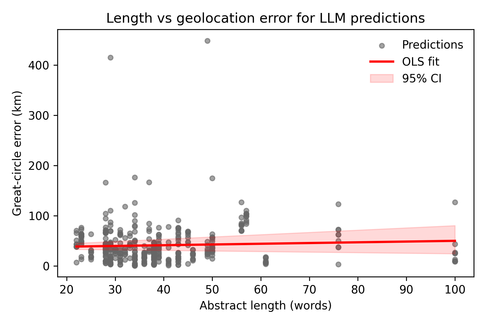

# Length-stratified accuracy (LLM methods only)
Length proxy = word-count of raw_entry (median = 36 words)

## Short abstracts (n = 286)
Overall mean error: **45.37 km**  (95 % CI 40.00–51.71)

| Method | n | Mean km |
|---|---|---|
| E-1 | 22 | 20.31 |
| E-2 | 22 | 21.94 |
| H-2 | 22 | 74.35 |
| H-3 | 22 | 92.91 |
| H-4 | 22 | 96.40 |
| M-1 | 22 | 37.37 |
| M-2 | 22 | 24.07 |
| M-3 | 22 | 51.50 |
| M-4 | 22 | 27.07 |
| M-5 | 22 | 25.89 |
| M-6 | 22 | 46.71 |
| T-1 | 22 | 36.07 |
| T-4 | 22 | 35.26 |

## Long abstracts (n = 273)
Overall mean error: **44.31 km**  (95 % CI 38.27–50.41)

| Method | n | Mean km |
|---|---|---|
| E-1 | 21 | 18.13 |
| E-2 | 21 | 19.14 |
| H-2 | 21 | 83.92 |
| H-3 | 21 | 95.71 |
| H-4 | 21 | 63.50 |
| M-1 | 21 | 46.13 |
| M-2 | 21 | 22.69 |
| M-3 | 21 | 48.94 |
| M-4 | 21 | 30.01 |
| M-5 | 21 | 30.08 |
| M-6 | 21 | 39.22 |
| T-1 | 21 | 39.31 |
| T-4 | 21 | 39.30 |

## Continuous length–error relationship
Across **559** LLM predictions, an OLS fit yields:

error_km = 41.15  +  0.095 · length_words

Slope: **0.095 km per word**  (95 % CI -0.161–0.406)

Pearson r = 0.028;  R² = 0.001

{#fig:length-vs-error width="80%"}
